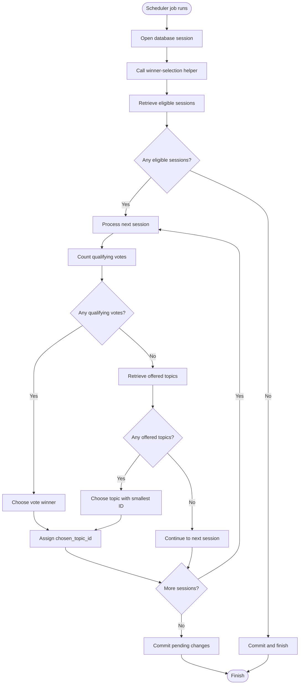

# Automatic Winner Selection — Technical Flowchart

```mermaid
flowchart TD
    A([Scheduler job runs]) --> B[Open database session]
    B --> C[Call winner-selection helper]
    C --> D[Retrieve eligible sessions]
    D --> E{Any eligible sessions?}

    E -- No --> Z[Commit and finish]
    E -- Yes --> F[Process next session]

    F --> G[Count qualifying votes]
    G --> H{Any qualifying votes?}

    H -- Yes --> I[Choose vote winner]
    H -- No --> J[Retrieve offered topics]

    J --> K{Any offered topics?}
    K -- Yes --> L[Choose topic with smallest ID]
    K -- No --> M[Continue to next session]

    I --> N[Assign chosen_topic_id]
    L --> N
    N --> O{More sessions?}
    M --> O

    O -- Yes --> F
    O -- No --> P[Commit pending changes]
    P --> Q([Finish])
    Z --> Q
```
